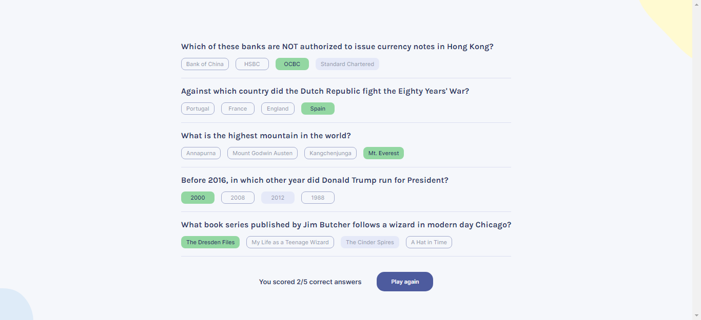

# Quiz App 
 My first Reactjs web App - this project is built as final solo project at scrimba react course 

## Table of Contents

* [overview](#overview)
* [Built with](#built-with)
* [lessons learned](#lessons-learned)
* [screen shot](#screen-shot)
* [links](#links)
* [Author](#author)

## Overview
[(Back to top)](#table-of-contents)

A solution to Quizz Ap project for scrimba solo poject

## Built with
[(Back to top)](#table-of-contents)
- HTML
- css
- javascript
- react.js

## Lessons Learned
[(Back to top)](#table-of-contents)

I have learned alot through this project as it is my first time to work with react . I learned how to use conditional rendering ,working with components , manging States and Side Effect and was really a good practice to my JavaScrit skills .

## screen shot
[(Back to top)](#table-of-contents)

## Links
[(Back to top)](#table-of-contents)

- Solution URL: [https://github.com/Elbassel511/Quiz-App--reactjs]
- Live Site URL: [https://elbassel511.github.io/Quiz-App--reactjs/]

## Author
[(Back to top)](#table-of-contents)

- Github - [@Elbassel511](https://github.com/Elbassel511)
- Linked in - [@Hamada Elbassel](https://www.linkedin.com/in/hamadaelbassel/)

